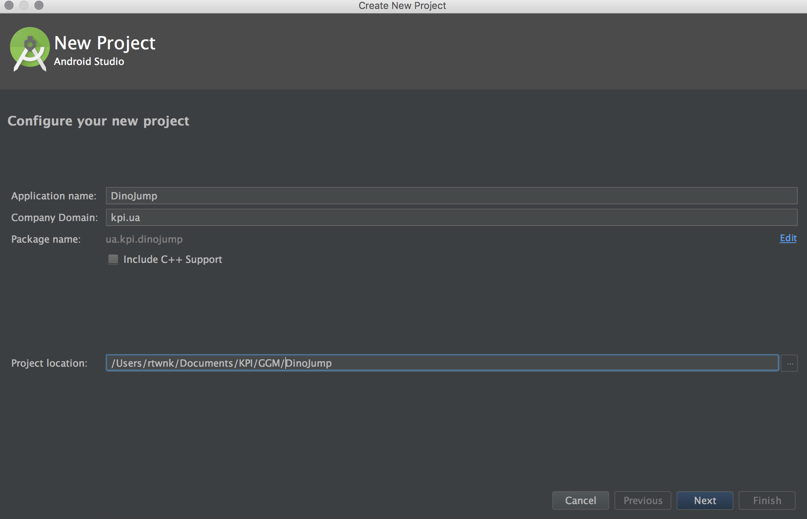
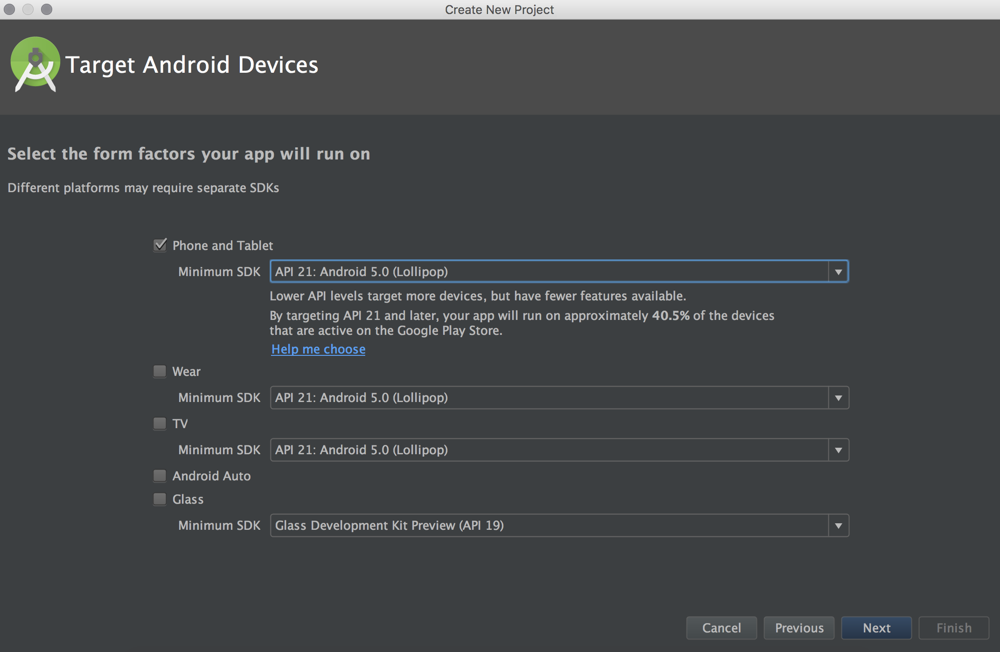
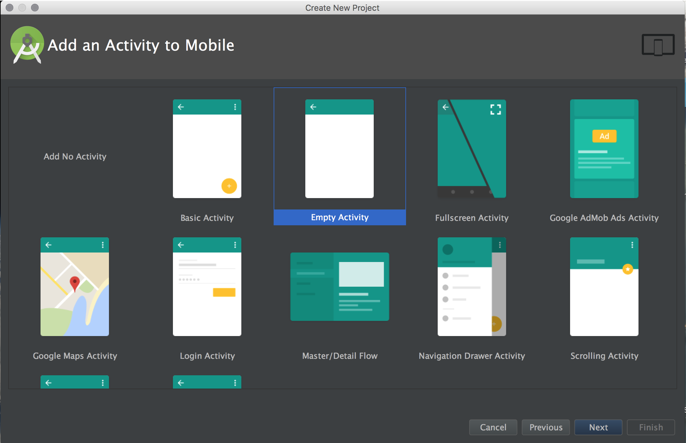
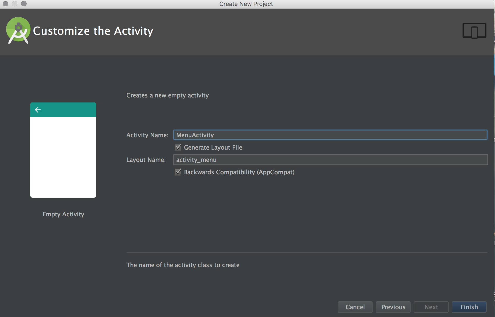
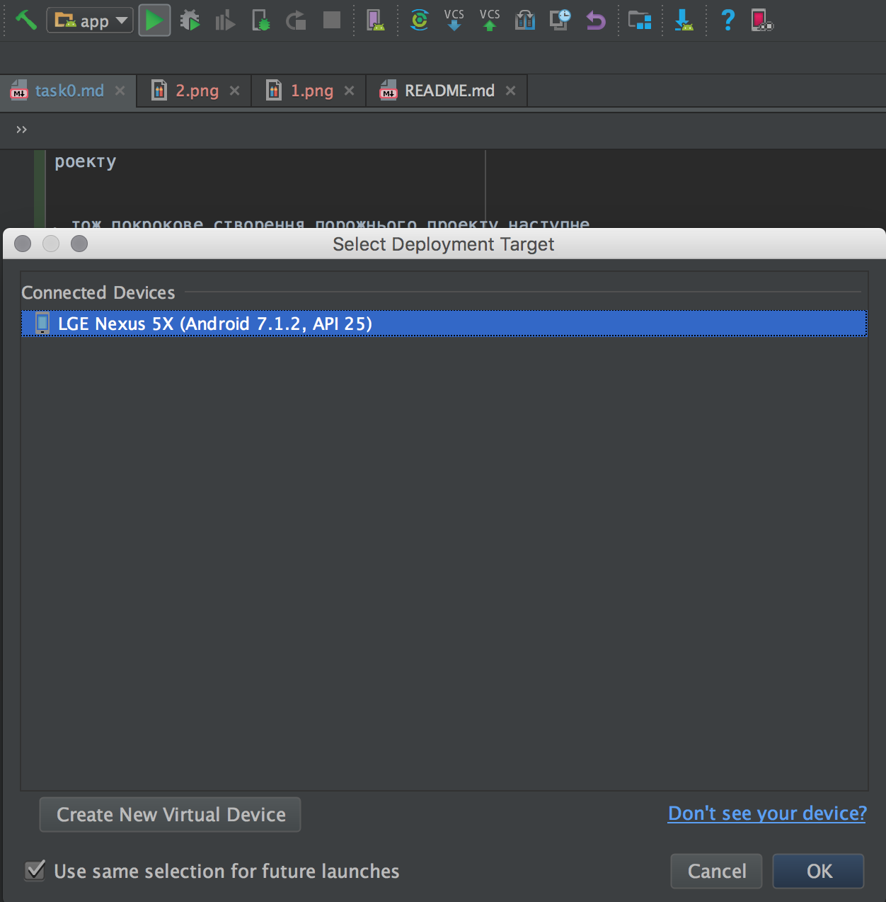

Налаштування середовища розробки та створення пустого проекту
===================

Середовищем розробки нашого додатку буде Android Studio, тож покрокове створення порожнього проекту наступне
_____

- оберіть опцію створити новий проект (підсвічено помаранчевим кольором)

- назвіть назву та домен для проекту, а також його розташування в ФС

- оберіть мінімальну версію Android (обрано 5.0)

- виберіть якого типу Activity за змовчуванням необхідно створити (можемо обрати Add no Activity і створити вручну),
  але оберемео Empty Activity, і тоді у нас буде створено відповідний xml файл з ресурсами та відповідна відмітка
  в маніфесті додатку

- перейменуємо на MenuActivity і дочекаємо закінчення створення проекту

- Можете для перевірки запустити проект, підключивши свій девайс до комп'ютера (Якщо його немає в списку доступних девайсів, перевірте налаштування опції [Developer Mode та Enabled USB Debugging](http://blog.syncios.com/enable-developer-optionsusb-debugging-mode-on-devices-with-android-4-2-jelly-bean/))

